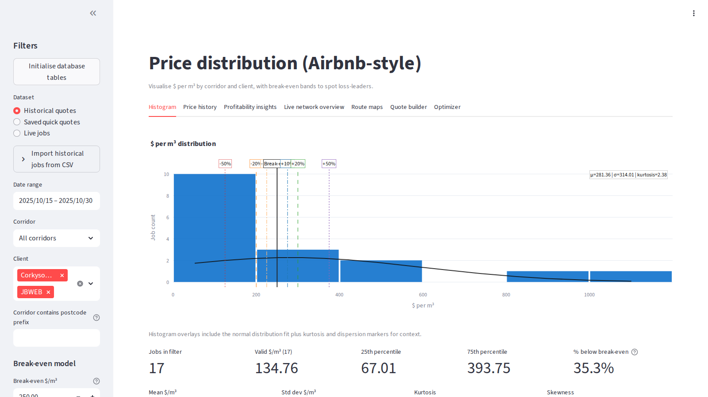
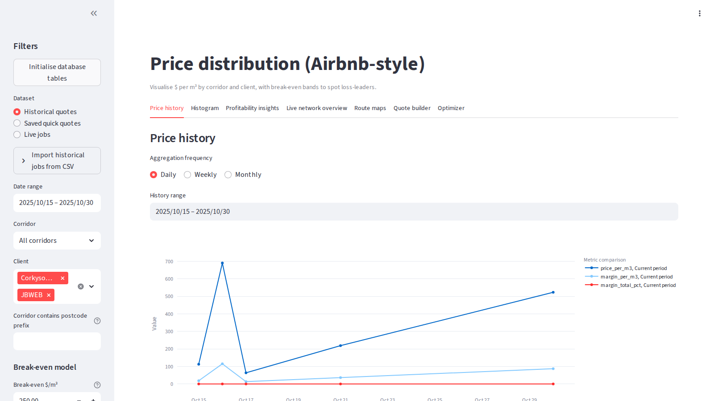
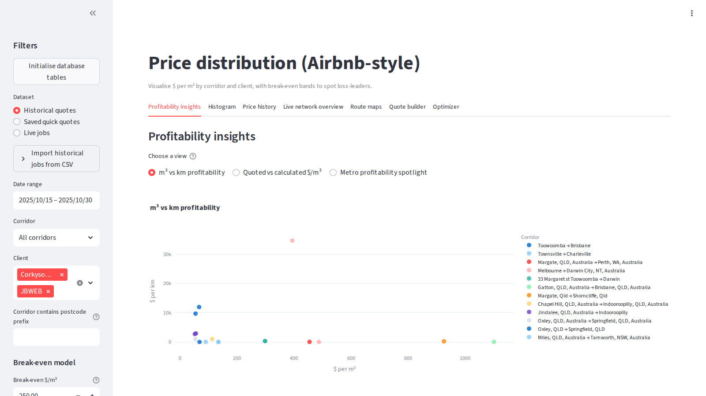
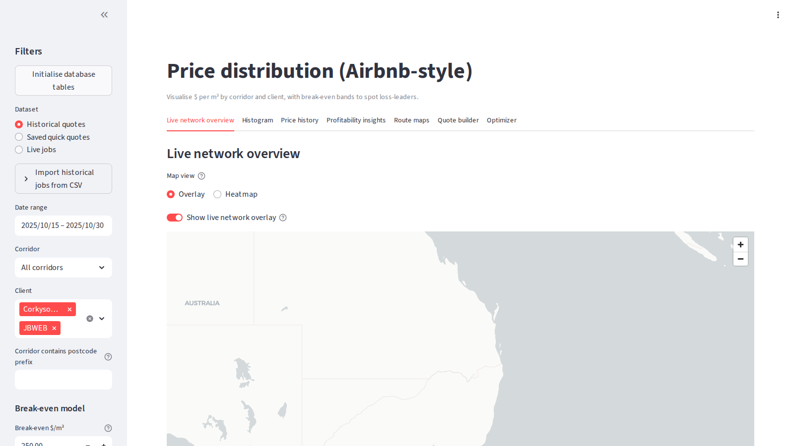
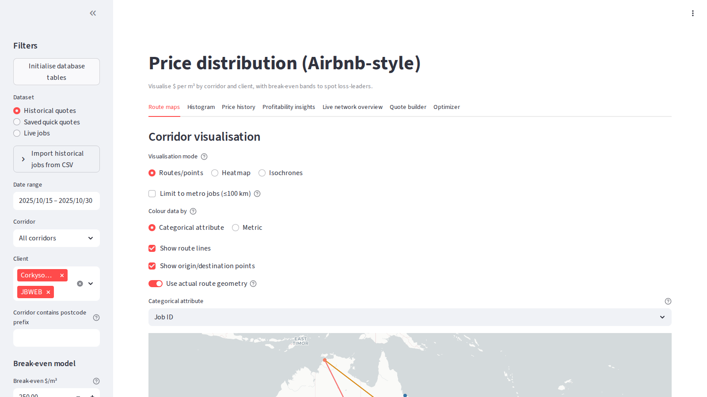
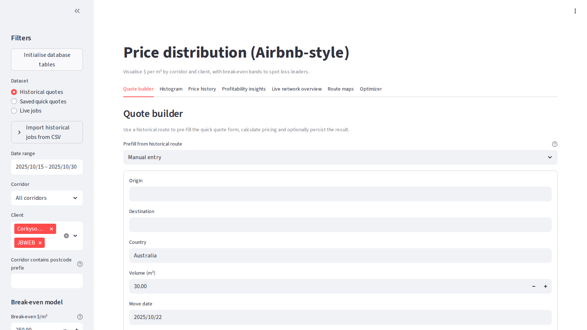
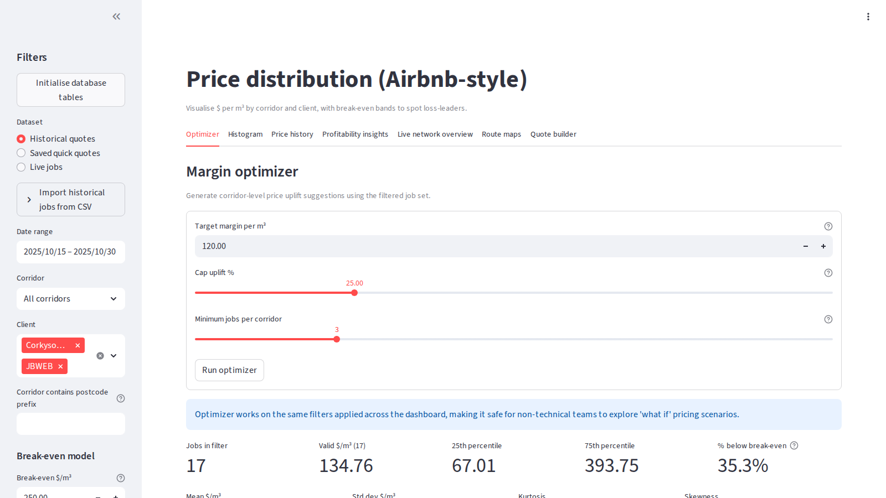

# corkysoft

Route profitability tooling for removals operators. The project couples a command-line workflow for distance lookups and cost capture with a Streamlit dashboard that surfaces price distribution, lane performance, and live telemetry overlays.

## Dashboard Preview

Explore the main dashboard workflows currently deployed at `http://192.168.4.53:8501/`:

<div align="center">
  
  
</div>
<div align="center">
  
  
</div>
<div align="center">
  
  
</div>
<div align="center">
  
</div>

## Table of Contents
- [Overview](#overview)
- [Key Components](#key-components)
- [Features](#features)
  - [CLI Toolkit](#cli-toolkit)
  - [Streamlit Dashboard](#streamlit-dashboard)
  - [Analytics Helpers](#analytics-helpers)
- [Getting Started](#getting-started)
- [Configuration](#configuration)
- [Usage](#usage)
  - [Command-Line Commands](#command-line-commands)
  - [Dashboard Workflows](#dashboard-workflows)
  - [Telemetry & Live Data](#telemetry--live-data)
- [Data Model & Storage](#data-model--storage)
- [Testing](#testing)
- [Documentation](#documentation)
- [Roadmap](#roadmap)

## Overview

`corkysoft` streamlines pricing analysis for moving and logistics teams by combining:
- Routing via [OpenRouteService](https://openrouteservice.org) with caching, address normalisation, and SQLite persistence.
- A Streamlit dashboard for exploring $/m³ distribution, lane margins, profitability overlays, and historical trends.
- Batch import/export helpers, mock telemetry ingestion, and a simplex-based profit optimiser to support planning exercises.

## Key Components

- `dashboard/app.py`: Streamlit entry point and UI layout.
- `dashboard/components/`: Reusable Streamlit widgets.
- `analytics/`: Data access, pricing insights, export helpers, and live data processing.
- `analytics/db.py`: Connection helpers and schema bootstrap.
- `docs/`: Feature specs such as `live_network_overview.md` and `price_history.md`.
- `routes_to_sqlite.py`: CLI for geocoding, routing, and cost capture.
- `tests/`: Pytest suites mirroring the main feature areas.

## Features

### CLI Toolkit

- Lookup driving distance (km) and duration (hours) between city names or addresses.
- Estimate billable costs using hourly and per-km rates with private cost ledgers per job.
- Cache geocodes and resolved addresses to minimise API calls.
- Normalise Australian street abbreviations and persist results in SQLite (`routes.db` by default).
- Import/export CSV datasets, including MoveWare-style history.

### Streamlit Dashboard

Launch with:

```bash
streamlit run dashboard/app.py
```

The dashboard surfaces:
- Histogram of $/m³ with configurable break-even bands, fitted curve diagnostics, and CSV export.
- Dataset selector that blends imported history, saved quick quotes, and live telemetry snapshots.
- Profitability tabs comparing $/m³, $/km, quoted versus cost-derived margins, and outlier tables.
- Interactive Mapbox map with corridor colouring, isochrone shading, lane filters, and density heatmaps.
- Live network view that highlights active trucks, lane profitability, and telemetry clusters.
- Quote builder with client dedupe, optional attachments, and quick-quote support without forcing customer records.
- Optimiser tab recommending corridor price uplifts and exportable action lists.
- Price history traces with daily/weekly/monthly resampling, prior-year comparisons, and lane box plots (see `docs/price_history.md`).

### Analytics Helpers

- Profitability exports: `analytics.price_distribution.build_profitability_export`.
- Corridor analytics: `analytics.price_distribution.aggregate_corridor_performance`.
- Simplex optimiser: `profit_optimizer.ProfitOptimizer` for evaluating constrained job mixes.
- HTML map generator: `map_jobs.py --show-actual` to compare straight-line vs routed geometry.

## Getting Started

Clone the repository and install dependencies inside a virtual environment:

```bash
python3 -m venv venv
source venv/bin/activate
pip install -r requirements.txt
```

## Configuration

Set your OpenRouteService API key so geocoding and routing calls can succeed:

```bash
export ORS_API_KEY="your_key_here"
```

Optional environment variables:

- `ROUTES_DB`: Path to the SQLite database (default `routes.db`).
- `ORS_COUNTRY`: Default country context for geocoding (default `Australia`).
- `CORKYSOFT_DB`: Alternate variable for pointing the dashboard at another SQLite database.

Commands that do not hit the OpenRouteService API (`add`, `add-csv`, `list`, `cost`, and `map` when geometry exists) work without the key.

## Usage

### Command-Line Commands

Invoke the CLI via:

```bash
python routes_to_sqlite.py <command> [options]
```

Common commands:

- Add a job:
  ```bash
  python routes_to_sqlite.py add "Melbourne" "Sydney" --hourly 200 --perkm 0.8
  ```
- Add jobs from CSV:
  ```bash
  python routes_to_sqlite.py add-csv jobs.csv
  ```
  `jobs.csv` must include headers such as `origin,destination,hourly_rate,per_km_rate,country`.
- Process pending jobs (fetch distance/duration via ORS):
  ```bash
  python routes_to_sqlite.py run
  ```
- Review stored jobs:
  ```bash
  python routes_to_sqlite.py list
  ```
- Track internal costs privately:
  ```bash
  python routes_to_sqlite.py cost add 1 crew --quantity 12 --rate 45 --unit hr --description "Crew wages"
  python routes_to_sqlite.py cost summary 1
  ```
- Import historical jobs with automatic geocoding and routing:
  ```bash
  python routes_to_sqlite.py import-history historical_jobs.csv --geocode --route
  ```
- Render an interactive map (add `--show-actual` to overlay routed geometry):
  ```bash
  python map_jobs.py --out routes_map.html
  ```

### Dashboard Workflows

- Initialise tables from the sidebar if starting with an empty database.
- Use the historical CSV uploader to ingest data mirroring the CLI headers (`date`, `origin`, `destination`, `m3`, `quoted_price`, `client`).
- Switch datasets between historical jobs, saved quick quotes, and live telemetry samples.
- Expand **Client details** in the quote builder for dedupe suggestions across name, phone, and address.
- Enable the live profitability view to expose corridor colour balancing, margin overlays, and hover diagnostics.

### Telemetry & Live Data

The Streamlit map expects live data in `truck_positions` and `active_routes`. A mock ingestor keeps these tables warm:

```bash
python -m analytics.ingest_live_data --interval 5 --iterations 0
```

Flags:
- `--interval`: Seconds between updates.
- `--iterations`: Number of cycles (omit for continuous streaming).
- `--trucks`: Override the seeded truck identifiers.

Historical jobs with geocoded origins/destinations backfill the mock data so the map always has active corridors.

## Data Model & Storage

- SQLite database defaults to `routes.db` in the project root.
- Schema helpers (table creation, migrations, connection scopes) live in `analytics/db.py`.
- `global_parameters` stores network-wide cost settings that feed the dashboard break-even engine.
- Corridor aggregation utilities produce bidirectional lanes and profitability KPIs for systemic diagnostics.

## Testing

Run the full test suite with:

```bash
pytest
```

Target a specific area via `pytest tests/test_price_distribution.py` or similar when iterating quickly.

## Documentation

- `docs/live_network_overview.md`: Functional spec for the profitability-focused network map.
- `docs/price_history.md`: Reference for the price history analytics and lane comparisons.
- `docs/mock_telemetry_workflow.md`: Details of the telemetry ingestion harness.
- `ROADMAP.md`: Active deliverables, progress snapshot, and upcoming work.

## Roadmap

See `ROADMAP.md` for the full delivery plan, status flags, and next steps across routing, analytics, telemetry, and governance.
