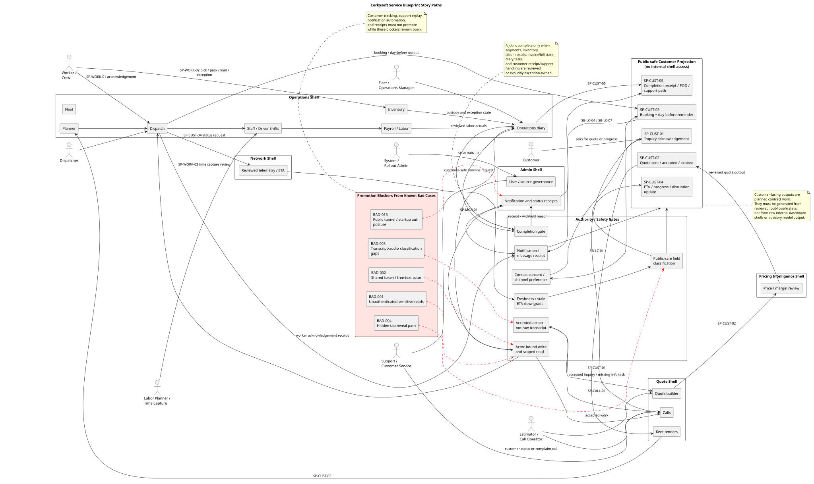

# corkysoft

## CEO Takeaway

Corkysoft improves the removals workflow from quote to completion.

It connects the main business flows: inquiry, quote, booking, dispatch, crew,
inventory, ETA, completion, and customer updates.

Today, staff often chase information across calls, MoveWare, dispatch notes,
drivers, admin, and customer messages. Corkysoft turns that into a guided job
flow:

**Quote -> Booking -> Dispatch -> Live Status -> Completion -> Receipt / Support**

The value is:

**faster quoting, cleaner handoffs, fewer missed details, better customer
updates, and stronger proof when a job is complete.**

The governance gates are not the headline. They are the guardrails that make
automation safe.

The product is the **workflow improvement layer** between messy internal
operations and polished customer-facing service.

[Live Network](docs/live_network_overview.md)
[Telemetry](docs/mock_telemetry_workflow.md)
[Price History](docs/price_history.md)
[Positioning](docs/positioning.md)
[Integration Staging Schema](docs/integration_staging_schema.md)
[Corridor Detection](docs/corridor_detection.md)
[Corridor Schema Plan](docs/corridor_schema_plan.md)
[Corridor Defaults](docs/corridor_defaults.md)
[AU Cluster Template](docs/cluster_template_au.md)
[Corridor Opportunity Report](docs/corridor_opportunity_report.md)
[Corridor Opportunity View](docs/corridor_opportunity_view.md)
[AMS Backend Docs Playbook](docs/ams_backend_docs_playbook.md)
[Kent AMS Integration Spec](docs/kent_ams_integration.md)
[Kent AMS Integration Roadmap](docs/kent_ams_integration_roadmap.md)
[Multi-Truck Route/Load Optimization](docs/multi_truck_route_load_optimization.md)
[Operator User Stories](docs/operator_user_stories.md)
[Usage Onboarding Guide](docs/usage_onboarding_guide.md)
[Service Blueprint](docs/service_blueprint.md)
[UI Role Coverage Matrix](docs/ui_role_coverage_matrix.md)
[Naive User Tester Notes](docs/naive_user_tester_notes.md)
[Rollout Execution Stories](docs/rollout_execution_user_stories.md)
[Quote to Award Lifecycle](docs/commercial_workflow_lifecycle.md)
[Spreadsheet Replacement Plan](docs/spreadsheet_replacement_plan.md)
[Planner Interaction Model](docs/planner_interaction_model.md)
[Operations Diary Workflow](docs/operations_diary_workflow.md)
[Job Cost and Invoice Reconciliation](docs/job_cost_and_invoice_reconciliation.md)
[Adaptive Learning Loop](docs/adaptive_learning_loop.md)
[Auth Red-Team Plan](docs/auth_red_team_plan.md)
[API Security And Authority Contract](docs/api_security_authority.md)
[Corkysoft / SB / ITIR Coverage Audit](docs/corkysoft_sb_itir_coverage_audit.md)
[Corkysoft -> SB / ITIR Downstream Contract](docs/sb_itir_downstream_contract.md)
[Corkysoft MCP v1 Contract](docs/corkysoft_mcp_v1.md)
[Planner / Diary Patterns For SB / ITIR](docs/planner_diary_patterns_for_sb_itir.md)
[Inventory Execution Workflow](docs/inventory_execution_workflow.md)
[Worker Time Capture Workflow](docs/worker_time_capture_workflow.md)
[Payroll and Labor Analytics](docs/payroll_and_labor_analytics.md)
[Accommodation Availability Operations](docs/accommodation_availability_operations.md)
[Call Intelligence Workflow](docs/call_intelligence_workflow.md)
[Contributor Docs Sync](docs/contributor_docs_sync.md)
[Known Bugs And Bad Cases](docs/known_bad_cases.md)
[Roadmap](ROADMAP.md)


Corkysoft is workflow tooling for removals operators. The project couples
quote, routing, dispatch, inventory, live status, and completion workflows with
a Streamlit dashboard that surfaces price distribution, lane performance, and
live telemetry overlays.

Run `./start_app.sh` or `start_app.bat` to run the app.

Environment rule:
- use the repo virtualenv exclusively for Python, Streamlit, and pytest once
  it exists; prefer `venv/bin/python`, `venv/bin/streamlit`, and
  `venv/bin/pytest` over system executables

## Start Here

- Estimator / quoting flow: [Quote to Award Lifecycle](docs/commercial_workflow_lifecycle.md)
- Dispatch / jobs / execution flow: [Spreadsheet Replacement Plan](docs/spreadsheet_replacement_plan.md)
- Planner UX target: [Planner Interaction Model](docs/planner_interaction_model.md)
- Manager day/week cockpit: [Operations Diary Workflow](docs/operations_diary_workflow.md)
- Job cost and invoicing review: [Job Cost and Invoice Reconciliation](docs/job_cost_and_invoice_reconciliation.md)
- Adaptive pricing/ETA/risk policy intent: [Adaptive Learning Loop](docs/adaptive_learning_loop.md)
- Auth hardening and red-team coverage: [Auth Red-Team Plan](docs/auth_red_team_plan.md)
- API security and authority contract:
  [API Security And Authority Contract](docs/api_security_authority.md)
- Architecture and generated UML suite: [UML Index](docs/UML_INDEX.md)
- Service blueprint story-path diagram:
  [source](docs/diagrams/service_blueprint_flows.puml) |
  [SVG](docs/diagrams/service_blueprint_flows.svg) |
  [PNG](docs/diagrams/service_blueprint_flows.png)
- Cross-project coverage and boundary audit: [Corkysoft / SB / ITIR Coverage Audit](docs/corkysoft_sb_itir_coverage_audit.md)
- Downstream contract for SB/ITIR consumers: [Corkysoft -> SB / ITIR Downstream Contract](docs/sb_itir_downstream_contract.md)
- MCP adapter contract for read-only cross-project/tooling access: [Corkysoft MCP v1 Contract](docs/corkysoft_mcp_v1.md)
- Planner now supports both job-first and map/corridor-first planning, confirms draft legs into `job_segments`, uses the shared provider-aware routing preview, keeps saved-route overlays aligned with the active provider, surfaces first-pass street-level and Google-first 360 site context, and can store accepted site-risk assessments plus advisory media/CV outputs against jobs; the existing `Operations` segment form remains advanced/manual fallback.
- Inventory execution workflow: [Inventory Execution Workflow](docs/inventory_execution_workflow.md)
- Dispatch / tender triage flow: [Kent AMS Integration Spec](docs/kent_ams_integration.md)
- Product and actor intent: [Operator User Stories](docs/operator_user_stories.md)
- Role-to-surface ownership: [UI Role Coverage Matrix](docs/ui_role_coverage_matrix.md)
- Formal onboarding and help usage: [Usage Onboarding Guide](docs/usage_onboarding_guide.md)
- End-to-end service, customer, notification, worker, and completion matrices:
  [Service Blueprint](docs/service_blueprint.md)
- Visual service blueprint story paths:
  [SVG](docs/diagrams/service_blueprint_flows.svg) |
  [PNG](docs/diagrams/service_blueprint_flows.png)
- Out-loud user-testing notes: [Naive User Tester Notes](docs/naive_user_tester_notes.md)
- Cutover, fallback, and rollout governance: [Rollout Execution Stories](docs/rollout_execution_user_stories.md)
- Current delivery status: [Roadmap](ROADMAP.md)
- Current bug/risk register: [Known Bugs And Bad Cases](docs/known_bad_cases.md)

## Operational Roles

The current top-level shell is:

- `Quote`
- `Pricing Intelligence`
- `Network`
- `Operations`
- `Admin`

Nested workflows such as `Quote builder`, `Calls`, `Kent tenders`, `Dispatch`,
`Planner`, `Operations diary`, `Fleet`, `Inventory`, and `Kent admin` now live
inside those five entry views rather than acting as the top-level shell.

- `Estimator`: starts in `Quote`.
- `Dispatcher`: starts in `Operations`, with `Quote` for tender/quote follow-through.
- `Fleet / Operations Manager`: starts in `Operations`, with `Network` for live context.
- `Labor Planner / Staff Coordinator`: starts in `Operations`.
- `Maintenance / Compliance Coordinator`: starts in `Operations`, with `Network` for live context.
- `Inventory / Supplier Coordinator`: starts in `Operations`.
- `Warehouse / Crew`: starts in `Operations`.
- `Workforce Time Capture Coordinator`: starts in `Operations`.
- `Owner / Commercial / Finance-facing Manager`: starts in `Pricing Intelligence`, with `Operations` for follow-through.
- `Commercial Owner`: starts in `Quote` and `Pricing Intelligence`, with `Admin` treated as a secondary/read-only governance surface unless acting in the admin role.
- `System / Rollout Admin`: starts in `Admin`.

See [UI Role Coverage Matrix](docs/ui_role_coverage_matrix.md) for the authoritative tab ownership map.

Documentation authority:
- [UI Role Coverage Matrix](docs/ui_role_coverage_matrix.md) owns role and surface mapping.
- [Operator User Stories](docs/operator_user_stories.md) owns actor decisions and actions.
- [Usage Onboarding Guide](docs/usage_onboarding_guide.md) owns practical daily-use guidance.
- [Service Blueprint](docs/service_blueprint.md) owns lifecycle, customer, notification, worker, and completion matrices.
- [Service Blueprint Flows](docs/diagrams/service_blueprint_flows.puml) owns the
  diagrammatic attribution of user story paths to shells, interactions, and
  authority gates.


- [Progress status board](docs/progress_status_board.md) owns current status.
- [Known Bugs And Bad Cases](docs/known_bad_cases.md) owns confirmed bugs and accepted risks.
- [API Security And Authority Contract](docs/api_security_authority.md) owns
  internal API read/write authority, scoped credential, and actor-binding
  acceptance criteria.

## Current Status (2026-04-02)

Latest tracking page: [Progress status board](docs/progress_status_board.md)

Core routing + costing are stable. The Streamlit dashboard is implemented and
usable, but some workflows remain provisional or governance-light:

- the major shell revision is now landed: the dashboard is organized around
  `Quote`, `Pricing Intelligence`, `Network`, `Operations`, and `Admin`
- legacy leaf surfaces still exist, but they now sit inside those workflow
  views rather than defining the top-level navigation
- docs and onboarding are being collapsed onto the new shell so operator entry
  guidance matches the implemented UI
- the new KPI and alert treatment in the workflow views is currently
  scaffolding-level; treat it as presentation structure, not yet as sourced
  operational truth

- quote builder is implemented and persists quotes
- quote builder now includes benchmark overlays, recommendation guidance, and
  backhaul-aware discount headroom in the live workflow
- Kent tender triage is implemented for internal/provisional use
- profitability and route analytics are implemented across multiple tabs
- situational-awareness ingestion now persists closure, weather, and traffic
  severity events and feeds bounded adaptive policy updates
- historical ingest now records run-level coverage, row-level issues, and
  readiness status, with Fleet-admin visibility for ingest health
- corridor / lane formalization now has canonical cluster, directional-lane,
  and corridor-group persistence; historical/live rows carry assignment status,
  Fleet admin exposes assignment health plus promotion governance, and Planner
  plus analytics tabs default to canonically assigned lane history unless
  operators opt into ambiguous or unassigned rows; grouped lane-promotion
  review is available for repeated candidate cluster pairs
- live network, corridor, and optimization docs still describe more than the
  current MVP guarantees
- visual last-mile planning now has a durable data model for site media, accepted site assessments, reviewed advisory CV/volume outputs, and first derived planning constraints (truck suitability, shuttle need, labor/access uplift). Actual model-backed CV inference remains scaffold-only
- the major app/api/pricing refactor wave is complete enough that the main
  dashboard shell, API root, and pricing entry surface are now composition
  layers rather than the previous main hotspots
- the architecture/UML layer is now generated from the internal import graph,
  with source and rendered supermega entrypoints under `docs/UML_INDEX.md`
- the canonical shell docs now treat `Quote`, `Pricing Intelligence`,
  `Network`, `Operations`, and `Admin` as the only top-level entrypoints;
  `Planner`, `Dispatch`, `Operations diary`, `Kent tenders`, and `Kent admin`
  are nested workflows inside those owning views

Main blockers to reach the next phase:
- operator workflow and governance completion
- dashboard shell remediation so operational roles do not inherit analytics-first framing
- role-layout reset and workspace-state hardening so role-aware landing,
  support-safe shared links, and reproducible shell/workflow state work
  predictably in local and authenticated runs
- remaining rerun-compatibility cleanup in live operator surfaces before the next testing wave
- deeper sourcing and operationalization of the implemented manager-facing
  day/week diary workflow above Planner, Dispatch, and reconciliation
- Kent contract validation against real payloads and real operator usage

High-leverage next features:
- route and tender calibration against live operator feedback
- deepen the implemented operations diary cockpit with sourced metrics,
  richer review state, and stronger reconciliation follow-through
- customer invoice and subcontractor-bill reconciliation against job usage truth
- requirements/proposal/governance formalization for international and
  compliance-heavy jobs
- paperwork, insurance, tender, customs, and audit package completeness review
  before quote/award/dispatch decisions
- transport-agnostic downstream diary/reconciliation export contract for
  StatiBaker / ITIR consumers
- pattern extraction from Corkysoft planner/diary workflows for future SB/ITIR
  lens design without making SB the workflow owner
- dual-marker reconciliation aging so delayed supplier bills can be reviewed by
  job execution date, bill receipt date, latency, and unresolved age
- Kent admin/operator workflow split
- deterministic role-aware landing plus support-safe, reproducible
  workspace-state sharing and safer session-layout reset/repair behavior
- stronger visual separation between execution and admin sections in mixed surfaces (`Fleet`, `Inventory`, `Staff`)
- multi-truck transfer and split policy definition before solver work

Note: `Crusader.xlsx` remains a local fallback/fixture, but the intended source of truth for fleet/staff/supplier operational data is Google Sheets.


## Dashboard Preview

Explore the main dashboard workflows currently deployable locally.
| | | |
| :---: | :---: | :---: |
|  |  |  |
|  |  |  |
|  | | |

## Table of Contents
- [Overview](#overview)
- [Project Layout](#project-layout)
- [Key Components](#key-components)
- [Features](#features)
  - [CLI Toolkit](#cli-toolkit)
  - [Streamlit Dashboard](#streamlit-dashboard)
  - [Analytics Helpers](#analytics-helpers)
- [Getting Started](#getting-started)
- [Configuration](#configuration)
- [Usage](#usage)
  - [Command-Line Commands](#command-line-commands)
  - [Dashboard Workflows](#dashboard-workflows)
  - [Telemetry & Live Data](#telemetry--live-data)
- [Development Workflow](#development-workflow)
- [Data Model & Storage](#data-model--storage)
- [Testing](#testing)
- [Documentation](#documentation)
  - [Media ingest workflow](docs/media_ingest.md)
  - [Ingest, inventory, and logistics](docs/ingest_inventory_logistics.md)
  - [Integration staging schema](docs/integration_staging_schema.md)
  - [Corridor detection](docs/corridor_detection.md)
  - [Corridor schema plan](docs/corridor_schema_plan.md)
  - [Corridor defaults](docs/corridor_defaults.md)
  - [AU cluster template](docs/cluster_template_au.md)
  - [Corridor opportunity report](docs/corridor_opportunity_report.md)
  - [Corridor opportunity view](docs/corridor_opportunity_view.md)
  - [Operations diary workflow](docs/operations_diary_workflow.md)
  - [Job cost and invoice reconciliation](docs/job_cost_and_invoice_reconciliation.md)
  - [Adaptive learning loop](docs/adaptive_learning_loop.md)
  - [Corkysoft / SB / ITIR coverage audit](docs/corkysoft_sb_itir_coverage_audit.md)
  - [Corkysoft -> SB / ITIR downstream contract](docs/sb_itir_downstream_contract.md)
  - [Corkysoft MCP v1 contract](docs/corkysoft_mcp_v1.md)
  - [Planner / diary patterns for SB / ITIR](docs/planner_diary_patterns_for_sb_itir.md)
- [Roadmap](#roadmap)

## Overview

`corkysoft` streamlines pricing analysis for moving and logistics teams by combining:
- Routing via [OpenRouteService](https://openrouteservice.org) with caching, address normalisation, and SQLite persistence.
- A Streamlit dashboard for exploring $/m³ distribution, lane margins, profitability overlays, and historical trends.
- Batch import/export helpers, mock telemetry ingestion, and a simplex-based profit optimiser to support planning exercises.
- A manager-facing operations layer where planning, assignments, usage review,
  and invoicing/reconciliation converge around the same day/week and job
  context.
- A staged adaptive-learning layer that stores bounded policy parameters for
  lane pricing, ETA, and risk calibration.

Positioning:
- Corkysoft should be treated as a system of decision for removals operators:
  it should help decide what to quote, accept, assign, defer, reconcile, and
  escalate.
- It is not trying to replace every incumbent record system on day one.
  Instead, it should integrate with incumbents (MoveWare, SmartMoving, fleet
  trackers, accounting) while selectively formalizing the workflows where
  margin, risk, and governance depend on better decisions.
- One documented strategic gap is international/compliance-heavy work, where
  paperwork, insurance, tender, customs, and audit requirements need a more
  explicit requirements/proposal/governance workflow than the current MVP
  provides.
- Realised jobs and disruption signals such as closures, weather, and route
  exceptions should feed an explicit, reviewable policy state rather than drive
  ad hoc pricing rewrites.
See `docs/positioning.md` for the competitive landscape and integration strategy.

## Project Layout

The repository is intentionally flat so that CLI helpers, data assets, and dashboard code can evolve together. The following
tree highlights the directories you will touch most often:

```
.
├── analytics/              # Data access, pricing insights, telemetry ingestion
│   ├── db.py               # SQLite helpers and schema bootstrap
│   ├── ingest_live_data.py # Mock truck/route streamer backing the dashboard map
│   └── price_distribution.py # Corridor rollups, exports, and optimiser prep
├── corkysoft/              # Core routing, pricing, quote helpers, and MCP adapter
├── dashboard/              # Streamlit composition shell, control layers, and UI widgets
│   ├── app.py              # Main Streamlit composition entry point
│   ├── auth_ui.py          # Auth gate and authenticated user banner helpers
│   ├── data_controls.py    # Dataset, provider, ingest, and filter sidebar controls
│   ├── layout_state.py     # Role-layout hydration and reset helpers
│   ├── query_params.py     # Shared query-param compatibility helpers
│   ├── shell.py            # Role-aware shell copy and sidebar framing
│   ├── tab_registry.py     # Tab-order and landing-tab composition helpers
│   └── components/         # Leafy widgets shared across tabs
├── docs/                   # Feature specs, workflow guides, imagery used in the README
├── tests/                  # Pytest suites mirroring analytics and UI helpers
├── e2e/                    # Playwright flows and fixtures for UI smoke tests
├── map_jobs.py             # Utility for generating HTML route maps
├── profit_optimizer.py     # Simplex solver for corridor profitability adjustments
├── quick_quote.py          # Minimal CLI surface for single quotes
├── routes_to_sqlite.py     # Primary CLI for geocoding, routing, and cost capture
├── start_app.sh            # Convenience script for bootstrapping a venv and launching Streamlit
└── routes.db               # Default SQLite datastore (created locally, never commit secrets)
```

Supplementary notebooks, reference data, and migration helpers live alongside these directories (for example, `docs/img/` for
dashboard screenshots and `MIGRATE_AWAY_FROM_streamlit_price_distribution.py` for legacy entry points). Refer to
`ROADMAP.md` for an at-a-glance status of ongoing initiatives spanning each area.

## Key Components

- `dashboard/app.py`: Streamlit composition layer that wires auth, shell, tabs, and tab renderers.
- `dashboard/auth_ui.py`, `dashboard/query_params.py`, `dashboard/layout_state.py`, `dashboard/shell.py`, `dashboard/data_controls.py`, `dashboard/tab_registry.py`: extracted dashboard control layers around auth, routing, shell selection, sidebar controls, and tab composition.
- `dashboard/components/`: Reusable Streamlit widgets.
- `analytics/`: Data access, pricing insights, export helpers, and live data processing.
- `analytics/db.py`: Connection helpers and schema bootstrap.
- `analytics/adaptive_policy.py`: Adaptive policy parameter bootstrap, reads, and bounded updates.
- `corkysoft/mcp/`: Read-only-first MCP adapter registry, local bridge, and optional transport server.
- `docs/`: Feature specs such as `live_network_overview.md` and `price_history.md`.
- `routes_to_sqlite.py`: CLI for geocoding, routing, and cost capture.
- `tests/`: Pytest suites mirroring the main feature areas.

## Features

### CLI Toolkit

- Lookup driving distance (km) and duration (hours) between city names or addresses.
- Estimate billable costs using hourly and per-km rates with private cost ledgers per job.
- Cache geocodes and resolved addresses to minimise API calls.
- Normalise Australian street abbreviations and persist results in SQLite (`routes.db` by default).
- Import/export CSV datasets, including MoveWare-style history and Google Sheets-backed operational workbook imports.

## Mindmap


### Streamlit Dashboard

Launch with:

```bash
venv/bin/streamlit run dashboard/app.py
```

The dashboard surfaces:
- Histogram of $/m³ with configurable break-even bands, fitted curve diagnostics, and CSV export.
- Dataset selector that blends imported history, saved quick quotes, and live telemetry snapshots.
- Profitability tabs comparing $/m³, $/km, quoted versus cost-derived margins, and outlier tables.
- Interactive Mapbox map with corridor colouring, isochrone shading, lane filters, and density heatmaps.
- Live network view that highlights active trucks, lane profitability, and telemetry clusters.
- Quote builder with client dedupe, profitability policy preview, and quick-quote support without forcing customer records.
- Dispatch board with a native job-centric view across segments, trucks, workers, stock, suppliers, and readiness flags.
- Kent tender queue with profitability-rule prioritization, override capture, and audit history.
- Optimiser tab recommending corridor price uplifts and exportable action lists.
- Price history traces with daily/weekly/monthly resampling, prior-year comparisons, and lane box plots (see `docs/price_history.md`).

### Analytics Helpers

- Profitability exports: `analytics.price_distribution.build_profitability_export`.
- Corridor analytics: `analytics.price_distribution.aggregate_corridor_performance`.
- Simplex optimiser: `profit_optimizer.ProfitOptimizer` for evaluating constrained job mixes.
- HTML map generator: `map_jobs.py --show-actual` to compare straight-line vs routed geometry.

## Getting Started

Clone the repository and install dependencies inside a virtual environment:

```bash
python3 -m venv venv
source venv/bin/activate
pip install -r requirements.txt
```

## Configuration

### Choose a routing provider

The routing stack can call either [OpenRouteService](https://openrouteservice.org) (default) or [Google Maps Platform](https://developers.google.com/maps/documentation/routes). Select a provider via the `ROUTING_PROVIDER` environment variable (`ors` when unset) and provide the corresponding credentials in your shell or `.env` file.

```bash
export ROUTING_PROVIDER="ors"  # or "google"
```

Isochrones are requested only from the active provider. Google connectors that expose an `isochrones`/`isochrone` method feed travel-boundary polygons directly into the dashboard, producing detailed shapes instead of the circular fallbacks. The OpenRouteService provider continues to use its native isochrone endpoint when `ROUTING_PROVIDER=ors`. The UI falls back to evenly spaced circles only when the selected provider returns no geometry and approximate fallback is explicitly enabled.

#### OpenRouteService setup

- `ORS_API_KEY` (**required**): authenticate API calls used by the CLI and dashboard helpers.
- `ORS_COUNTRY` (optional): hint Pelias geocoding with a default country (defaults to `Australia`).

Usage notes:

- ORS free tiers throttle by request volume—review the [pricing and quota documentation](https://openrouteservice.org/pricing/) before running large batch jobs.
- CLI commands that avoid external lookups (`add`, `add-csv`, `list`, `cost`, `map` with cached geometry) still work without a key because they only touch the local SQLite database.

#### Google Maps setup

- `GOOGLE_MAPS_API_KEY` (**required when `ROUTING_PROVIDER=google`**): must have the [Directions API](https://developers.google.com/maps/documentation/directions/overview) (Routes API) and [Geocoding API](https://developers.google.com/maps/documentation/geocoding/overview) enabled.
- `GOOGLE_MAPS_REGION` (optional): two-letter region bias used for geocoding fallbacks.

Usage notes:

- Google bills per request—see the [Routes API usage and billing guide](https://developers.google.com/maps/documentation/routes/usage-and-billing) for live pricing and quota examples.
- Rate limits are enforced per key. If you expect heavy CLI automation, consider enabling per-request retries with exponential backoff in your wrapper scripts.

#### Shared environment variables

- `ROUTES_DB`: Path to the SQLite database (default `routes.db`).
- `CORKYSOFT_DB`: Alternate variable for pointing the dashboard at another SQLite database (overrides `ROUTES_DB` for analytics views).
- `CORKYSOFT_API_TOKEN`: Required for mutating internal API routes such as importer writes, Kent policy changes, and override recording.
- `OPERATIONS_WORKBOOK_SHEET_ID` or `OPERATIONS_WORKBOOK_URL`: Shared Google Sheets workbook for `FLEET`, `STAFF`, and `SUPPLIERS` imports.
- `OPERATIONS_STAFF_SHEET_NAME` (optional): Defaults to `STAFF` for shared-workbook staff sync.
- `OPERATIONS_SUPPLIERS_SHEET_NAME` (optional): Defaults to `SUPPLIERS` for shared-workbook supplier sync.
- `VEHICLE_DRIVER_SHEET_ID`: Google Sheet ID/URL for the `VEHICLE_DRIVER`/shift sheet.
- `SUPPLIERS_SHEET_ID` or `SUPPLIERS_SHEET_URL`: Optional supplier-specific override when suppliers do not live in the shared operations workbook.
- `VEHICLE_REPAIRS_SHEET_URL` or `VEHICLE_REPAIRS_SHEET`: Vehicle repairs Google Sheet source.

Use `.env.example` as a template when sharing configuration between teammates or CI runs.

### Running both providers

`routes_to_sqlite.py` and the dashboard reuse the same SQLite schema regardless of provider. Job rows and the `geocode_cache` table are populated from whichever routing service answered the request. When you toggle providers:

1. Decide whether to share or separate caches.
   - Shared cache: keep `ROUTES_DB` pointing at the same file. The most recent provider wins if coordinates differ because cache entries are keyed by the normalised address and country only.
   - Separate caches: export/import the database or point `ROUTES_DB` (and `CORKYSOFT_DB` for the dashboard) at provider-specific files before running batch jobs.
2. Re-run `routes_to_sqlite.py run` for any pending jobs so the new provider can populate `distance_km`, `duration_hr`, and `route_geojson` fields using its own routing engine.
3. Review downstream dashboards: all analytics charts read the same tables, so switching providers updates KPIs automatically once the CLI refreshes cached distances.

For operators alternating between providers, consider scripting dedicated CLI entry points (e.g., `routes_to_sqlite.py run --provider google`) that export the correct environment variables and database paths to avoid accidental cross-pollination.

## Usage

### Command-Line Commands

Invoke the CLI via:

```bash
venv/bin/python routes_to_sqlite.py <command> [options]
```

Common commands:

- Add a job:
  ```bash
  venv/bin/python routes_to_sqlite.py add "Melbourne" "Sydney" --hourly 200 --perkm 0.8
  ```
- Add jobs from CSV:
  ```bash
  venv/bin/python routes_to_sqlite.py add-csv jobs.csv
  ```
  `jobs.csv` must include headers such as `origin,destination,hourly_rate,per_km_rate,country`.
- Process pending jobs (fetch distance/duration via ORS):
  ```bash
  venv/bin/python routes_to_sqlite.py run
  ```
- Review stored jobs:
  ```bash
  venv/bin/python routes_to_sqlite.py list
  ```
- Track internal costs privately:
  ```bash
  venv/bin/python routes_to_sqlite.py cost add 1 crew --quantity 12 --rate 45 --unit hr --description "Crew wages"
  venv/bin/python routes_to_sqlite.py cost summary 1
  ```
- Import historical jobs with automatic geocoding and routing:
  ```bash
  venv/bin/python routes_to_sqlite.py import-history historical_jobs.csv --geocode --route
  ```
- Render an interactive map (add `--show-actual` to overlay routed geometry):
  ```bash
  venv/bin/python map_jobs.py --out routes_map.html
  ```
- Seed clustered mainland-Australia jobs, segments, and container requirements for local planning tests:
  ```bash
  venv/bin/python scripts/seed_planning_harness.py --count 10
  ```

### Dashboard Workflows

- Initialise tables from the sidebar if starting with an empty database.
- Use the historical CSV uploader to ingest data mirroring the CLI headers (`date`, `origin`, `destination`, `m3`, `quoted_price`, `client`).
- Switch datasets between historical jobs, saved quick quotes, and live telemetry samples.
- Expand **Client details** in the quote builder for dedupe suggestions across name, phone, and address.
- Review profitability policy pass/fail state in the quote builder before persisting a quote.
- Use the Kent tender queue to prioritize work, inspect flags, and record overrides with reason codes.
- Use Google Sheets-backed imports for `FLEET`, `STAFF`, and `SUPPLIERS` before falling back to ad hoc local workbook uploads.
- Use the shared operations-workbook sync in Fleet when you want `FLEET`, `STAFF`, and `SUPPLIERS` refreshed together from the same workbook reference.
- Treat Corkysoft as the planning source of truth for truck/staff/job-segment assignments; current spreadsheets are import-only operational inputs.
- Treat `job_segments` as the internal planning truth, but not as a low-level operator data-entry workflow. The long-term planner should derive draft legs from map/corridor/site context and let operators confirm them through click-heavy interactions rather than manual segment typing.
- Use the Dispatch tab as the native daily execution board for jobs, segments, trucks, workers, stock, suppliers, and exception review.
- Use the Staff and Fleet tabs to review planned segment assignments alongside imported sheet context and recent shift history.
- Use the Fleet cockpit to review blocked/due-soon rego, COI, service, and worker compliance items before confirming assignments.
- Use Fleet admin to manage spreadsheet cutover status, rollback instructions, targets, logged rollout events, and guarded recommended transitions per workflow; the current usage/fallback/review metrics are derived from operational state and event history.
- Use the Labor planning / Driver shifts tab as a native roster and reconciliation surface; treat `VEHICLE_DRIVER` imports as comparison input rather than primary planning truth.
- Use the Inventory tab to coordinate stock and suppliers against planned job segments, not only against whole-job balances.
- Inventory now supports segment-level requirement planning, shortage detection, custody/location truth, constrained warehouse pick / pack / load progression, and substitution requests/approvals backed by reason catalogs and approval-role rules.
- Next inventory UX step should be requirement/container picklists with explicit action buttons and barcode/QR-assisted capture, rather than more generic stage editing.
- Planner UX is still not at the desired end-state: the current hybrid planner now supports job-first and corridor-first planning with routing and resource-fit context, but site/location planning and richer draft-leg editing remain the next steps.
- Workforce time capture needs its own multi-channel path: app where available, WhatsApp where practical, and voice/landline call-in with transcription/review where necessary.
- Payroll and labor analytics are now explicitly framed as a separate layer above labor operations: Corkysoft should prepare reviewed labor actuals, forecasting, overtime/absence patterns, and export-ready summaries without trying to replace payroll/accounting systems.
- The first `Payroll / Labor analytics` cockpit is now implemented with pay forecasting, overtime/hours/cost distributions, plan-vs-actual comparisons, confidence/anomaly summaries, labor cost-driver views, export-ready worker summaries, and a basic recorded absence/leave model. Sick-day analytics should now build on explicit recorded absence rows rather than inferred missing events.
- Call intelligence foundation is live: the `Calls` tab now captures routed call sessions, child call legs, ambient office transcript sessions, transcript artifacts, accepted actions, and worker time-capture review through one operational substrate.
- Fake transcript generation remains the current practical ingest surface for call-session and ambient-session workflow testing while live telephony remains pending.
- Accommodation availability should be treated as an operational support signal for remote/peak-period work, not as a separate travel product.
- Treat the current live profitability/network views as MVP analytics surfaces; advanced drill-down and auto-refresh behavior remain future work unless explicitly documented elsewhere.
- Dashboard access now supports Google sign-in through Streamlit OIDC, backed by a local allowlist of Corkysoft users and role keys. A temporary owner/testing mode can auto-provision signed-in Google users as local admins via `CORKYSOFT_AUTO_PROVISION_GOOGLE_ADMIN=1`. See [Authentication and Users](docs/authentication_and_users.md).
- Role-aware tab defaults remain the role-surface contract, but authenticated users now resolve into those roles from local user records instead of relying only on anonymous in-session switching.
- The dashboard should visibly indicate whether the current run is authenticated via Google or operating in explicit anonymous local-development mode.
- Hidden tabs should not be treated as mere presentation preferences for auth-sensitive surfaces. Query-param navigation should not re-expose role-hidden admin tabs.

### Authentication And Users

Corkysoft now supports Google sign-in for the dashboard shell using Streamlit's built-in OIDC support.

- Google establishes identity; Corkysoft decides access and role assignment locally.
- Allowed users live in the local `dashboard_users` table and are matched by email.
- Shared/deployed environments should run with UI auth enabled and no anonymous entry path.
- Local development can still run anonymously, but only when `CORKYSOFT_ENV=development` and `CORKYSOFT_ALLOW_ANONYMOUS_UI=1` are set explicitly.

For Google sign-in, configure Streamlit secrets plus Authlib:

```toml
# .streamlit/secrets.toml
[auth]
redirect_uri = "http://localhost:8501/oauth2callback"
cookie_secret = "replace-me"

[auth.google]
client_id = "..."
client_secret = "..."
server_metadata_url = "https://accounts.google.com/.well-known/openid-configuration"
```

See [Authentication and Users](docs/authentication_and_users.md) for the full environment and bootstrap model.

### Telemetry & Live Data

The Streamlit map expects live data in `truck_positions` and `active_routes`. A mock ingestor keeps these tables warm:

```bash
venv/bin/python -m analytics.ingest_live_data --interval 5 --iterations 0
```

Flags:
- `--interval`: Seconds between updates.
- `--iterations`: Number of cycles (omit for continuous streaming).
- `--trucks`: Override the seeded truck identifiers.
- `--start-date` / `--end-date`: Restrict historical jobs to a specific date window (YYYY-MM-DD).

Historical jobs with geocoded origins/destinations backfill the mock data so the map always has active corridors. If no jobs
match the window, the ingestor chains depot-to-depot routes so trucks still depart from a depot before heading toward
customer origins.
To ingest real GPS snapshots from a file or stdin (newline-delimited JSON or CSV), stream them into the telemetry harness:

```bash
venv/bin/python -m analytics.ingest_real_gps snapshots.ndjson --batch-size 250 --iterations 1
```

Flags:
- `--db-path`: Target database (defaults to `routes.db` resolution).
- `--iterations`: Number of batches to process before exiting.
- `--batch-size`: Number of snapshots per commit.
- `--format`: Force CSV or JSON when auto-detection is ambiguous.

Historical jobs with geocoded origins/destinations backfill the mock data so the map always has active corridors.

## Development Workflow

Contributor docs/update policy: see [Contributor Docs Sync](docs/contributor_docs_sync.md).
Known bugs, bad cases, and accepted risks are tracked in
[Known Bugs And Bad Cases](docs/known_bad_cases.md).

- **Bootstrap the environment**: Run `python3 -m venv venv && source venv/bin/activate && venv/bin/python -m pip install -r requirements.txt`.
- **Launch locally**: Use `venv/bin/streamlit run dashboard/app.py` after the virtualenv exists.
- **Iterate on analytics**: Modify modules inside `analytics/` and run targeted tests via `venv/bin/python -m pytest tests/test_<area>.py` to
  validate corridor aggregations, optimiser helpers, and export routines before wiring them into Streamlit.
- **Exercise the CLI**: Use `venv/bin/python routes_to_sqlite.py` to seed `routes.db`, export CSVs, and sanity-check new schema changes before
  exposing them through the dashboard sidebar uploads.
- **Preview UI updates**: Launch the dashboard with `venv/bin/streamlit run dashboard/app.py`, switch datasets in the sidebar, and keep
  an eye on the terminal logs for warnings emitted by `analytics/db.py` when migrations are required.
- **Keep docs current**: When behaviour or workflows change, update `README.md`, `docs/*.md`, and `ROADMAP.md` so new
  contributors can follow the intended flows without spelunking through code.

## Data Model & Storage

- SQLite database defaults to `routes.db` in the project root.
- Schema helpers (table creation, migrations, connection scopes) live in `analytics/db.py`.
- `global_parameters` stores network-wide cost settings that feed the dashboard break-even engine.
- Corridor aggregation utilities produce bidirectional lanes and profitability KPIs for systemic diagnostics.
- Fleet metadata, repair ledger, and driver shift tables extend `trucks`/`workers` with supplier and labour context. See `docs/fleet_tables.md` for column layouts and ingestion helpers.

## Testing

Run the full test suite with:

```bash
venv/bin/python -m pytest
```

Target a specific area via `venv/bin/python -m pytest tests/test_price_distribution.py` or similar when iterating quickly.


## Documentation

- `docs/media_ingest.md`: Capture→upload workflow for PEC stills and bodycam clips, including triggers, required metadata, hashing, storage layout, and linkage to `movement_events`/items.
- `docs/ingest_inventory_logistics.md`: Contracts for ingest payloads, inventory reconciliation, and logistics movement events plus their linkage to jobs, telemetry, and dashboard overlays.
- `docs/fleet_tables.md`: Column reference for vehicle metadata, supplier-tagged repair history, and driver shift tables.
- `docs/live_network_overview.md`: Functional spec for the profitability-focused network map.
- `docs/price_history.md`: Reference for the price history analytics and lane comparisons.
- `docs/mock_telemetry_workflow.md`: Details of the telemetry ingestion harness.
- `docs/architecture.md`: High-level architecture outline covering how the Streamlit shell composes analytics modules and supporting services.
- `docs/modules.md`: Module-by-module ownership and entry point summary.
- `docs/service_blueprint.md`: End-to-end lifecycle, customer communication, worker execution, call follow-up, and completion-gate matrices.
- `docs/known_bad_cases.md`: Canonical register for confirmed bugs, bad cases, accepted risks, owner lanes, and promotion gates.
- `docs/operator_user_stories.md`: Actor-based product workflows and decisions.
- `docs/commercial_workflow_lifecycle.md`: Quote -> tender -> override -> awarded-work lifecycle.
- `ROADMAP.md`: Active deliverables, progress snapshot, and upcoming work.

PEC photos and bodycam clips follow a capture → queue → upload → storage pipeline with on-device hashing, server-side verification, and foreign-key links back to movement events and tagged items for auditability.

## Roadmap

See `ROADMAP.md` for the full delivery plan, status flags, and next steps across routing, analytics, telemetry, and governance.
