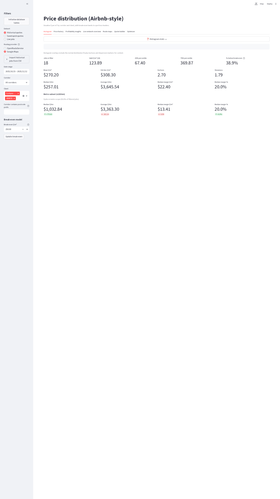
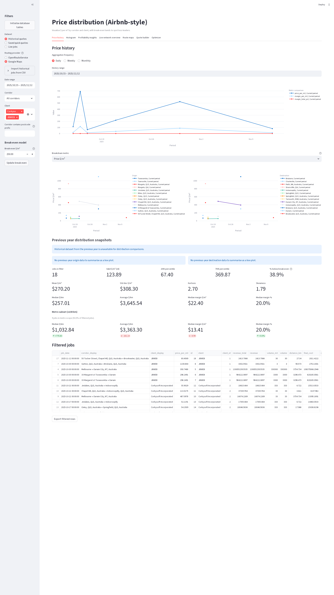
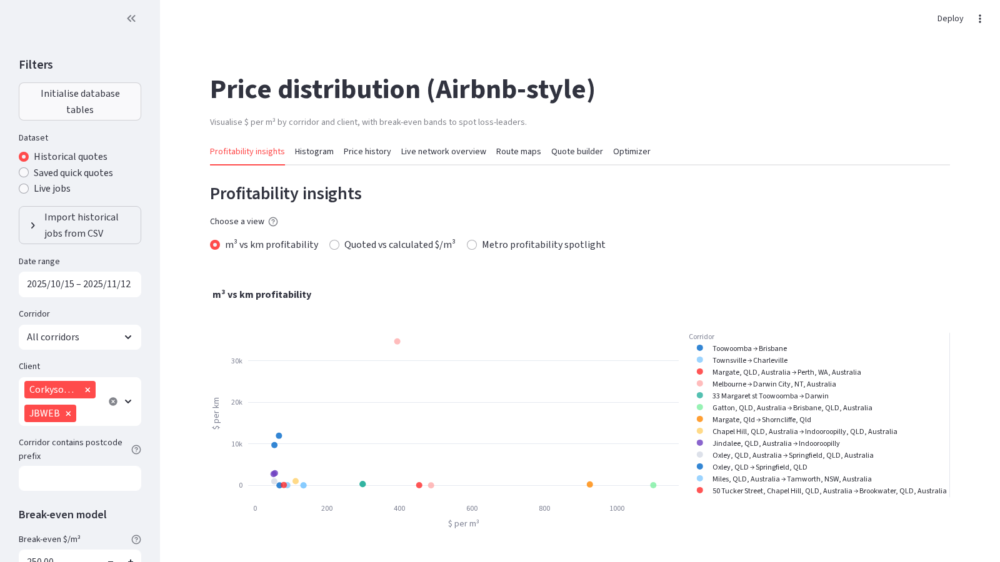
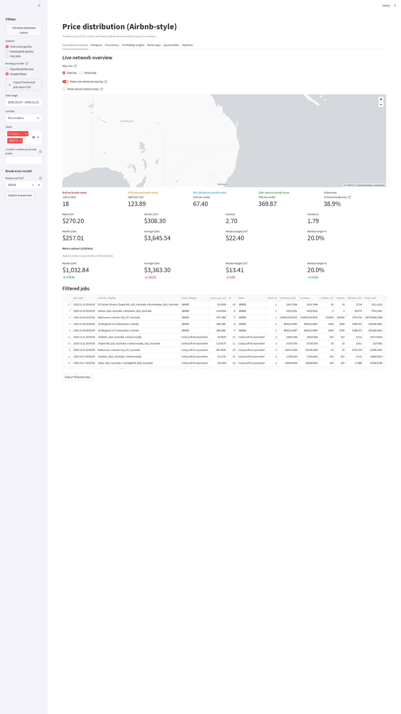
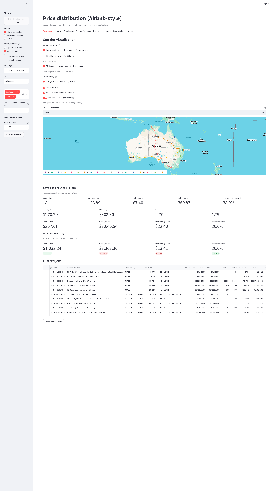
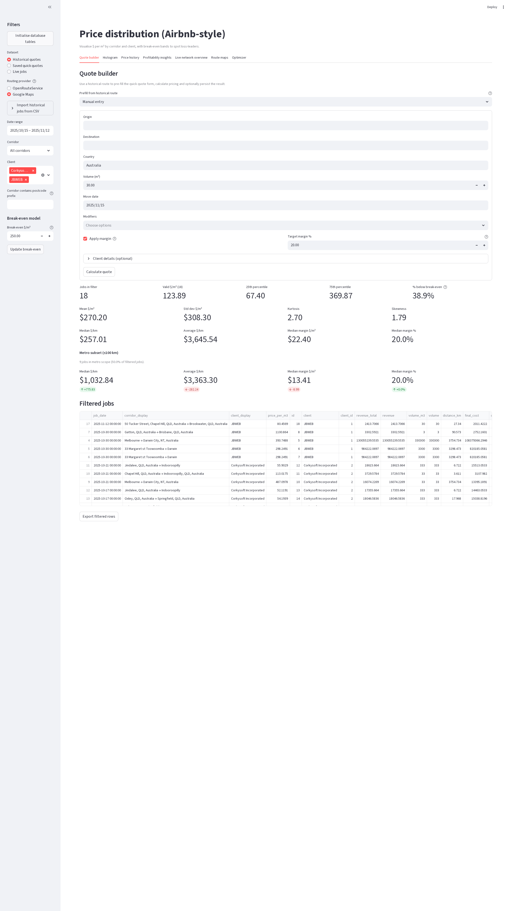
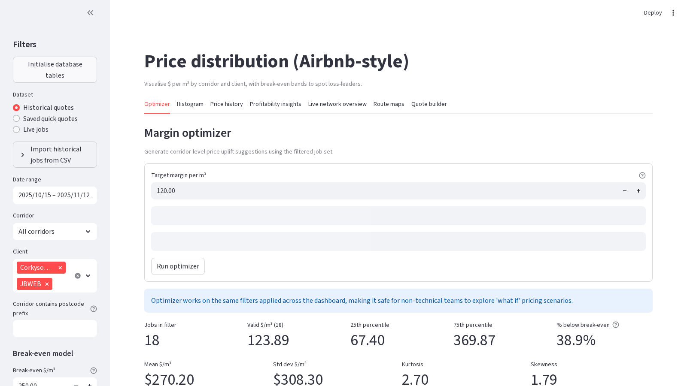

# corkysoft
[Live Network](docs/live_network_overview.md)
[Telemetry](docs/mock_telemetry_workflow.md)
[Price History](docs/price_history.md)
[Roadmap](ROADMAP.md)


Route profitability tooling for removals operators. The project couples a command-line workflow for distance lookups and cost capture with a Streamlit dashboard that surfaces price distribution, lane performance, and live telemetry overlays.

## Dashboard Preview

Explore the main dashboard workflows currently deployable locally.
| | | |
| :---: | :---: | :---: |
|  |  |  |
|  |  |  |
|  | | |

## Table of Contents
- [Overview](#overview)
- [Project Layout](#project-layout)
- [Key Components](#key-components)
- [Features](#features)
  - [CLI Toolkit](#cli-toolkit)
  - [Streamlit Dashboard](#streamlit-dashboard)
  - [Analytics Helpers](#analytics-helpers)
- [Getting Started](#getting-started)
- [Configuration](#configuration)
- [Usage](#usage)
  - [Command-Line Commands](#command-line-commands)
  - [Dashboard Workflows](#dashboard-workflows)
  - [Telemetry & Live Data](#telemetry--live-data)
- [Development Workflow](#development-workflow)
- [Data Model & Storage](#data-model--storage)
- [Testing](#testing)
- [Documentation](#documentation)
  - [Media ingest workflow](docs/media_ingest.md)
- [Roadmap](#roadmap)

## Overview

`corkysoft` streamlines pricing analysis for moving and logistics teams by combining:
- Routing via [OpenRouteService](https://openrouteservice.org) with caching, address normalisation, and SQLite persistence.
- A Streamlit dashboard for exploring $/m³ distribution, lane margins, profitability overlays, and historical trends.
- Batch import/export helpers, mock telemetry ingestion, and a simplex-based profit optimiser to support planning exercises.

## Project Layout

The repository is intentionally flat so that CLI helpers, data assets, and dashboard code can evolve together. The following
tree highlights the directories you will touch most often:

```
.
├── analytics/              # Data access, pricing insights, telemetry ingestion
│   ├── db.py               # SQLite helpers and schema bootstrap
│   ├── ingest_live_data.py # Mock truck/route streamer backing the dashboard map
│   └── price_distribution/ # Corridor rollups, exports, and optimiser prep
├── dashboard/              # Streamlit entry point and reusable widgets
│   ├── app.py              # Main Streamlit application
│   └── components/         # Leafy widgets shared across tabs
├── docs/                   # Feature specs, workflow guides, imagery used in the README
├── tests/                  # Pytest suites mirroring analytics and UI helpers
├── e2e/                    # Playwright flows and fixtures for UI smoke tests
├── map_jobs.py             # Utility for generating HTML route maps
├── profit_optimizer.py     # Simplex solver for corridor profitability adjustments
├── quick_quote.py          # Minimal CLI surface for single quotes
├── routes_to_sqlite.py     # Primary CLI for geocoding, routing, and cost capture
├── start_app.sh            # Convenience script for bootstrapping a venv and launching Streamlit
└── routes.db               # Default SQLite datastore (created locally, never commit secrets)
```

Supplementary notebooks, reference data, and migration helpers live alongside these directories (for example, `docs/img/` for
dashboard screenshots and `MIGRATE_AWAY_FROM_streamlit_price_distribution.py` for legacy entry points). Refer to
`ROADMAP.md` for an at-a-glance status of ongoing initiatives spanning each area.

## Key Components

- `dashboard/app.py`: Streamlit entry point and UI layout.
- `dashboard/components/`: Reusable Streamlit widgets.
- `analytics/`: Data access, pricing insights, export helpers, and live data processing.
- `analytics/db.py`: Connection helpers and schema bootstrap.
- `docs/`: Feature specs such as `live_network_overview.md` and `price_history.md`.
- `routes_to_sqlite.py`: CLI for geocoding, routing, and cost capture.
- `tests/`: Pytest suites mirroring the main feature areas.

## Features

### CLI Toolkit

- Lookup driving distance (km) and duration (hours) between city names or addresses.
- Estimate billable costs using hourly and per-km rates with private cost ledgers per job.
- Cache geocodes and resolved addresses to minimise API calls.
- Normalise Australian street abbreviations and persist results in SQLite (`routes.db` by default).
- Import/export CSV datasets, including MoveWare-style history.

## Mindmap


### Streamlit Dashboard

Launch with:

```bash
streamlit run dashboard/app.py
```

The dashboard surfaces:
- Histogram of $/m³ with configurable break-even bands, fitted curve diagnostics, and CSV export.
- Dataset selector that blends imported history, saved quick quotes, and live telemetry snapshots.
- Profitability tabs comparing $/m³, $/km, quoted versus cost-derived margins, and outlier tables.
- Interactive Mapbox map with corridor colouring, isochrone shading, lane filters, and density heatmaps.
- Live network view that highlights active trucks, lane profitability, and telemetry clusters.
- Quote builder with client dedupe, optional attachments, and quick-quote support without forcing customer records.
- Optimiser tab recommending corridor price uplifts and exportable action lists.
- Price history traces with daily/weekly/monthly resampling, prior-year comparisons, and lane box plots (see `docs/price_history.md`).

### Analytics Helpers

- Profitability exports: `analytics.price_distribution.build_profitability_export`.
- Corridor analytics: `analytics.price_distribution.aggregate_corridor_performance`.
- Simplex optimiser: `profit_optimizer.ProfitOptimizer` for evaluating constrained job mixes.
- HTML map generator: `map_jobs.py --show-actual` to compare straight-line vs routed geometry.

## Getting Started

Clone the repository and install dependencies inside a virtual environment:

```bash
python3 -m venv venv
source venv/bin/activate
pip install -r requirements.txt
```

## Configuration

### Choose a routing provider

The routing stack can call either [OpenRouteService](https://openrouteservice.org) (default) or [Google Maps Platform](https://developers.google.com/maps/documentation/routes). Select a provider via the `ROUTING_PROVIDER` environment variable (`ors` when unset) and provide the corresponding credentials in your shell or `.env` file.

```bash
export ROUTING_PROVIDER="ors"  # or "google"
```

Isochrones are requested from the active provider when available. Google connectors that expose an `isochrones`/`isochrone` method feed travel-boundary polygons directly into the dashboard, producing detailed shapes instead of the circular fallbacks. The OpenRouteService provider continues to use its native isochrone endpoint (returning GeoJSON polygons when accessible), and the UI falls back to evenly spaced circles only when neither provider returns geometry.

#### OpenRouteService setup

- `ORS_API_KEY` (**required**): authenticate API calls used by the CLI and dashboard helpers.【F:routes_to_sqlite.py†L1-L60】【F:corkysoft/routing.py†L31-L60】
- `ORS_COUNTRY` (optional): hint Pelias geocoding with a default country (defaults to `Australia`).【F:routes_to_sqlite.py†L9-L13】

Usage notes:

- ORS free tiers throttle by request volume—review the [pricing and quota documentation](https://openrouteservice.org/pricing/) before running large batch jobs.
- CLI commands that avoid external lookups (`add`, `add-csv`, `list`, `cost`, `map` with cached geometry) still work without a key because they only touch the local SQLite database.【F:routes_to_sqlite.py†L714-L963】

#### Google Maps setup

- `GOOGLE_MAPS_API_KEY` (**required when `ROUTING_PROVIDER=google`**): must have the [Directions API](https://developers.google.com/maps/documentation/directions/overview) (Routes API) and [Geocoding API](https://developers.google.com/maps/documentation/geocoding/overview) enabled.
- `GOOGLE_MAPS_REGION` (optional): two-letter region bias used for geocoding fallbacks.

Usage notes:

- Google bills per request—see the [Routes API usage and billing guide](https://developers.google.com/maps/documentation/routes/usage-and-billing) for live pricing and quota examples.
- Rate limits are enforced per key. If you expect heavy CLI automation, consider enabling per-request retries with exponential backoff in your wrapper scripts.

#### Shared environment variables

- `ROUTES_DB`: Path to the SQLite database (default `routes.db`).【F:routes_to_sqlite.py†L9-L13】
- `CORKYSOFT_DB`: Alternate variable for pointing the dashboard at another SQLite database (overrides `ROUTES_DB` for analytics views).【F:analytics/db.py†L9-L15】

Use `.env.example` as a template when sharing configuration between teammates or CI runs.

### Running both providers

`routes_to_sqlite.py` and the dashboard reuse the same SQLite schema regardless of provider. Job rows and the `geocode_cache` table are populated from whichever routing service answered the request.【F:routes_to_sqlite.py†L32-L139】【F:routes_to_sqlite.py†L635-L711】【F:corkysoft/routing.py†L83-L146】 When you toggle providers:

1. Decide whether to share or separate caches.
   - Shared cache: keep `ROUTES_DB` pointing at the same file. The most recent provider wins if coordinates differ because cache entries are keyed by the normalised address and country only.【F:corkysoft/routing.py†L83-L140】
   - Separate caches: export/import the database or point `ROUTES_DB` (and `CORKYSOFT_DB` for the dashboard) at provider-specific files before running batch jobs.
2. Re-run `routes_to_sqlite.py run` for any pending jobs so the new provider can populate `distance_km`, `duration_hr`, and `route_geojson` fields using its own routing engine.【F:routes_to_sqlite.py†L635-L711】【F:routes_to_sqlite.py†L856-L963】【F:corkysoft/routing.py†L412-L507】
3. Review downstream dashboards: all analytics charts read the same tables, so switching providers updates KPIs automatically once the CLI refreshes cached distances.【F:analytics/db.py†L9-L75】

For operators alternating between providers, consider scripting dedicated CLI entry points (e.g., `routes_to_sqlite.py run --provider google`) that export the correct environment variables and database paths to avoid accidental cross-pollination.

## Usage

### Command-Line Commands

Invoke the CLI via:

```bash
python routes_to_sqlite.py <command> [options]
```

Common commands:

- Add a job:
  ```bash
  python routes_to_sqlite.py add "Melbourne" "Sydney" --hourly 200 --perkm 0.8
  ```
- Add jobs from CSV:
  ```bash
  python routes_to_sqlite.py add-csv jobs.csv
  ```
  `jobs.csv` must include headers such as `origin,destination,hourly_rate,per_km_rate,country`.
- Process pending jobs (fetch distance/duration via ORS):
  ```bash
  python routes_to_sqlite.py run
  ```
- Review stored jobs:
  ```bash
  python routes_to_sqlite.py list
  ```
- Track internal costs privately:
  ```bash
  python routes_to_sqlite.py cost add 1 crew --quantity 12 --rate 45 --unit hr --description "Crew wages"
  python routes_to_sqlite.py cost summary 1
  ```
- Import historical jobs with automatic geocoding and routing:
  ```bash
  python routes_to_sqlite.py import-history historical_jobs.csv --geocode --route
  ```
- Render an interactive map (add `--show-actual` to overlay routed geometry):
  ```bash
  python map_jobs.py --out routes_map.html
  ```

### Dashboard Workflows

- Initialise tables from the sidebar if starting with an empty database.
- Use the historical CSV uploader to ingest data mirroring the CLI headers (`date`, `origin`, `destination`, `m3`, `quoted_price`, `client`).
- Switch datasets between historical jobs, saved quick quotes, and live telemetry samples.
- Expand **Client details** in the quote builder for dedupe suggestions across name, phone, and address.
- Enable the live profitability view to expose corridor colour balancing, margin overlays, and hover diagnostics.

### Telemetry & Live Data

The Streamlit map expects live data in `truck_positions` and `active_routes`. A mock ingestor keeps these tables warm:

```bash
python -m analytics.ingest_live_data --interval 5 --iterations 0
```

Flags:
- `--interval`: Seconds between updates.
- `--iterations`: Number of cycles (omit for continuous streaming).
- `--trucks`: Override the seeded truck identifiers.
- `--start-date` / `--end-date`: Restrict historical jobs to a specific date window (YYYY-MM-DD).

Historical jobs with geocoded origins/destinations backfill the mock data so the map always has active corridors. If no jobs
match the window, the ingestor chains depot-to-depot routes so trucks still depart from a depot before heading toward
customer origins.
To ingest real GPS snapshots from a file or stdin (newline-delimited JSON or CSV), stream them into the telemetry harness:

```bash
python -m analytics.ingest_real_gps snapshots.ndjson --batch-size 250 --iterations 1
```

Flags:
- `--db-path`: Target database (defaults to `routes.db` resolution).
- `--iterations`: Number of batches to process before exiting.
- `--batch-size`: Number of snapshots per commit.
- `--format`: Force CSV or JSON when auto-detection is ambiguous.

Historical jobs with geocoded origins/destinations backfill the mock data so the map always has active corridors.

## Development Workflow

- **Bootstrap the environment**: Run `python3 -m venv venv && source venv/bin/activate && pip install -r requirements.txt`
  (or execute `./start_app.sh` to combine setup with a `streamlit run dashboard/app.py`).
- **Iterate on analytics**: Modify modules inside `analytics/` and run targeted tests via `pytest tests/test_<area>.py` to
  validate corridor aggregations, optimiser helpers, and export routines before wiring them into Streamlit.
- **Exercise the CLI**: Use `routes_to_sqlite.py` to seed `routes.db`, export CSVs, and sanity-check new schema changes before
  exposing them through the dashboard sidebar uploads.
- **Preview UI updates**: Launch the dashboard with `streamlit run dashboard/app.py`, switch datasets in the sidebar, and keep
  an eye on the terminal logs for warnings emitted by `analytics/db.py` when migrations are required.
- **Keep docs current**: When behaviour or workflows change, update `README.md`, `docs/*.md`, and `ROADMAP.md` so new
  contributors can follow the intended flows without spelunking through code.

## Data Model & Storage

- SQLite database defaults to `routes.db` in the project root.
- Schema helpers (table creation, migrations, connection scopes) live in `analytics/db.py`.
- `global_parameters` stores network-wide cost settings that feed the dashboard break-even engine.
- Corridor aggregation utilities produce bidirectional lanes and profitability KPIs for systemic diagnostics.

## Testing

Run the full test suite with:

```bash
pytest
```

Target a specific area via `pytest tests/test_price_distribution.py` or similar when iterating quickly.


## Documentation

- `docs/media_ingest.md`: Capture→upload workflow for PEC stills and bodycam clips, including triggers, required metadata, hashing, storage layout, and linkage to `movement_events`/items.
- `docs/live_network_overview.md`: Functional spec for the profitability-focused network map.
- `docs/price_history.md`: Reference for the price history analytics and lane comparisons.
- `docs/mock_telemetry_workflow.md`: Details of the telemetry ingestion harness.
- `docs/architecture.md`: High-level architecture outline covering how the Streamlit shell composes analytics modules and supporting services.
- `ROADMAP.md`: Active deliverables, progress snapshot, and upcoming work.

PEC photos and bodycam clips follow a capture → queue → upload → storage pipeline with on-device hashing, server-side verification, and foreign-key links back to movement events and tagged items for auditability.

## Roadmap

See `ROADMAP.md` for the full delivery plan, status flags, and next steps across routing, analytics, telemetry, and governance.
